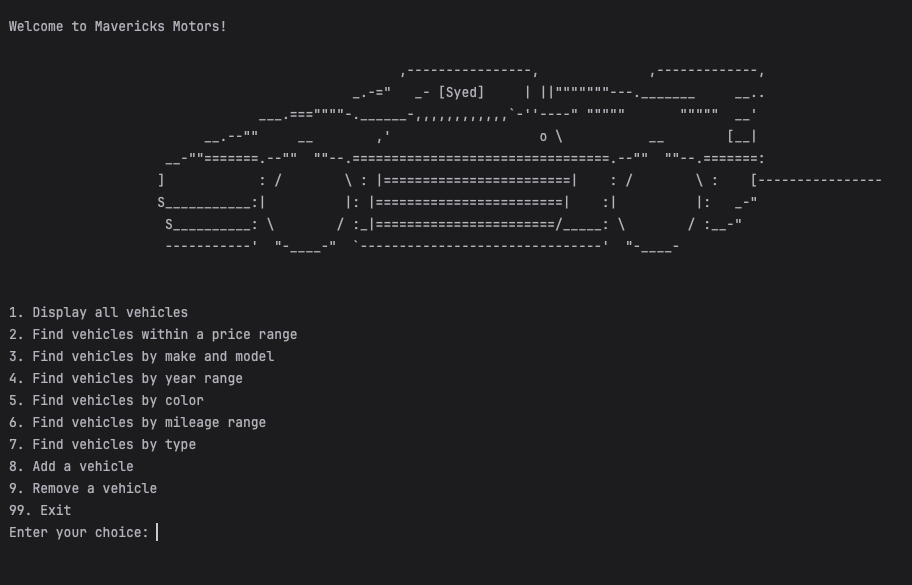
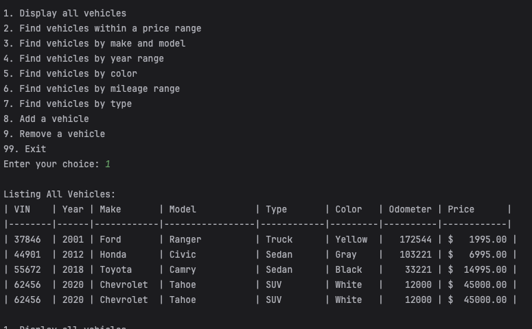
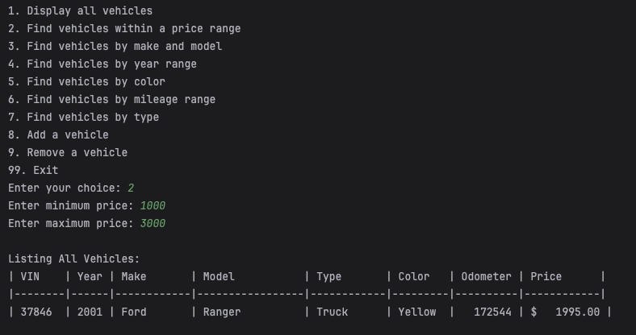
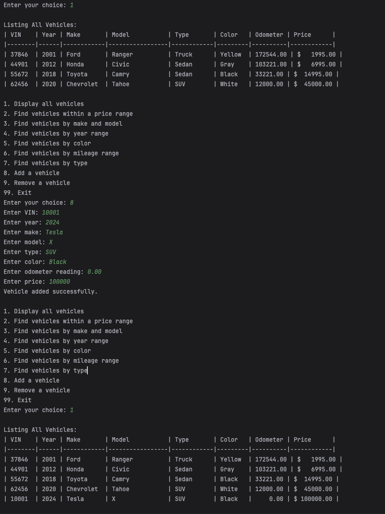
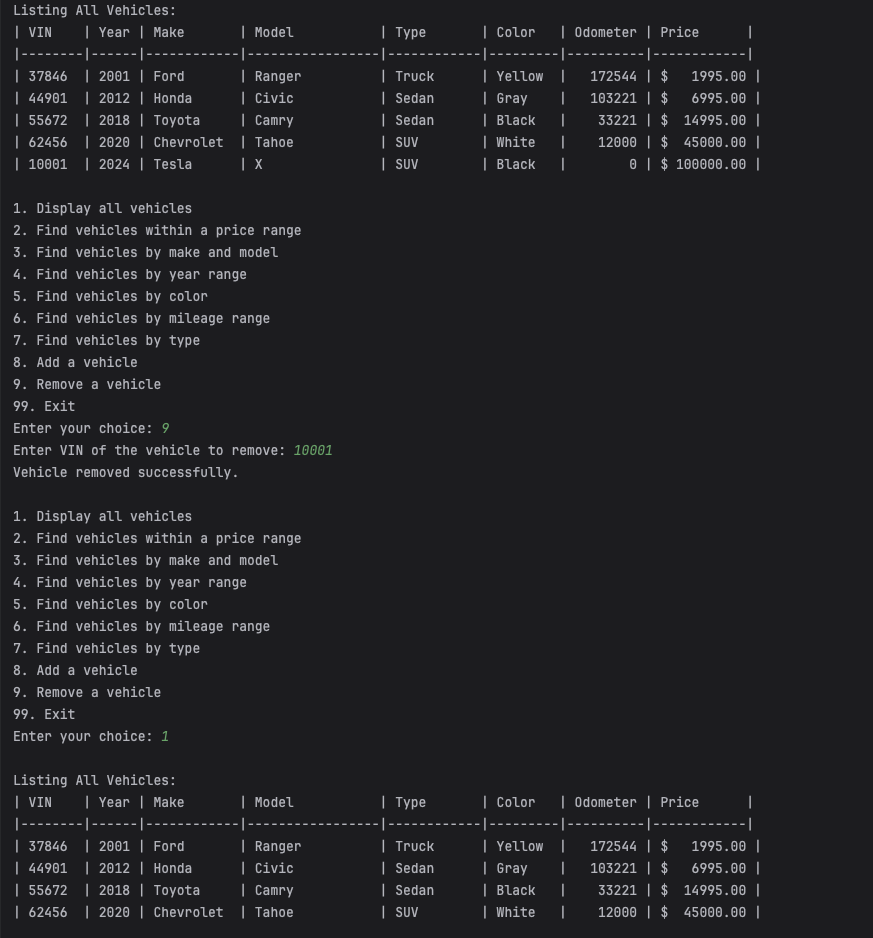
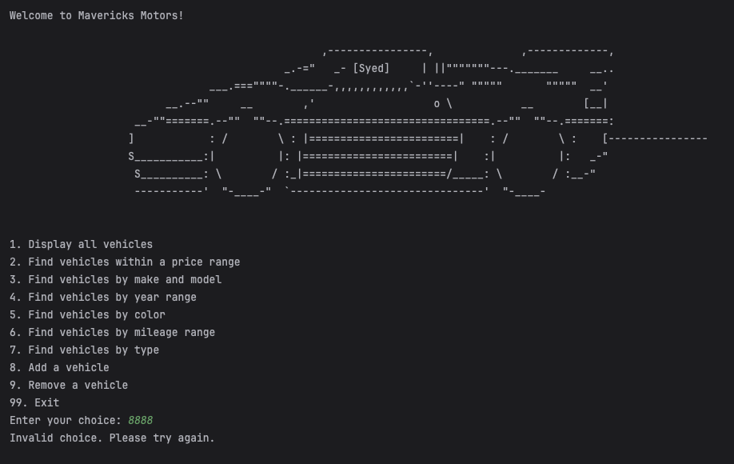
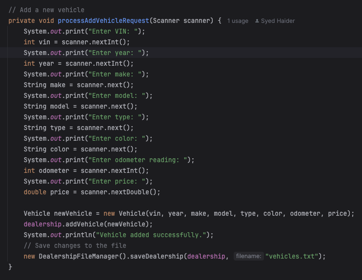
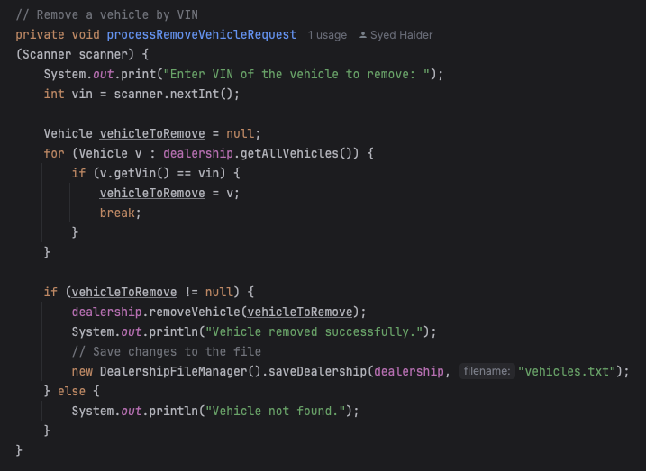

# Car Dealership Console Application

## Overview
This project is a console-based application that simulates the management of a car dealership, allowing users to interact with a vehicle inventory system. It enables sales managers or salesmen to perform a variety of tasks such as adding, removing, and searching for vehicles based on different criteria.

### Features
- **Search Vehicles:** Users can search vehicles by price, make/model, year, color, mileage, and type.
- **List Vehicles:** Display all vehicles in the dealership.
- **Modify Inventory:** Add or remove vehicles from the inventory.
- **Persistent Storage:** Vehicle data is stored in a pipe-delimited text file, which is updated upon inventory modifications.

## ____________________________________________________________________________________________________________

## Application Home Screen


### Click on the dropdown to see the features of the application. Each feature is explained by prompting the user to enter the necessary details to perform the task. 
You can perform the following actions from the home screen:

<details>

**<summary> Display all vehicles </summary>**




#### User can view all vehicles in the inventory. The vehicle list includes the vehicle's make, model, year, color, mileage, type, and price. In the above image, the user is viewing all vehicles in the inventory.
</details>

<details> 

**<summary> Find Vehicle By Price Range </summary>**



#### The user can find vehicle by various types of filters such as price range, make, model, year, color, mileage, and type. User could also add multiple filters. In the above image, the user is searching for vehicles with a price range of 1000 to 3000.

</details>

<details>

**<summary> Adding a Vehicle to the Inventory  </summary>**



#### User can add a vehicle to the inventory. The user is prompted to enter the details of the vehicle they are adding. In the above image, the user is adding a vehicle with the make "Tesla", model "X", year "2024", color "Black", mileage "0", type "SUV", and price "$100000". 
User added zero odometer reading for the new vehicle. The vehicle is successfully added to the inventory.


</details>

<details>

**<summary> Removing a Vehicle from the Inventory </summary>**



#### User can remove a vehicle from the inventory. The user is prompted to enter the details of the vehicle they are removing. In the above image, the user is removing a vehicle with the Vin number "10001" which is a Tesla X 2024. The vehicle is successfully removed from the inventory.

</details>

## ____________________________________________________________________________________________________________


## Error Handling




#### Anytime the user enters an invalid command, an "invalid command" message will show up, and the user will have to try again and enter a valid command.

## ____________________________________________________________________________________________________________
## Interesting Piece of Code

The interesting piece of code adding a vehicle to the inventory and removing a vehicle from the inventory by only using VIN number. The code snippet below shows how the vehicle is added to the inventory and removed from the inventory by using the VIN number.
### 1. Adding a Vehicle - `processAddVehicleRequest` Method Explanation.
 The `processAddVehicleRequest` method is designed to handle the addition of new vehicles to the dealership's inventory by interacting with the user to input the vehicle details and then updating the inventory.
### Steps Involved in the `processAddVehicleRequest` Method

1. **Prompt for Vehicle Information:**
   The method prompts the user to enter various details about the vehicle. This interactive process ensures that all the necessary data to create a new vehicle record is gathered from the user. Here are the details requested:

    - **VIN (Vehicle Identification Number):** A unique identifier for the vehicle.
    - **Year:** The production year of the vehicle.
    - **Make:** The manufacturer or brand of the vehicle (e.g., Honda, Tesla).
    - **Model:** The specific model name or number of the vehicle (e.g., Civic, Model S).
    - **Type:** The type or category of the vehicle (e.g., Sedan, SUV).
    - **Color:** The color of the vehicle.
    - **Odometer Reading:** The total mileage the vehicle has traveled.
    - **Price:** The sale price of the vehicle.

   Example prompts:

   ```java
   System.out.print("Enter VIN: ");
   int vin = scanner.nextInt();
   System.out.print("Enter year: ");
   int year = scanner.nextInt();

    ``` 
Additional prompts for make, model, type, color, odometer, and price are also included in the method. Here is the code snippet for the complete `processAddVehicleRequest` method:


### 2. Removing a Vehicle - `processRemoveVehicleRequest` Method Explanation.
The `processRemoveVehicleRequest` method is designed to handle the removal of vehicles from the dealership's inventory by interacting with the user to input the VIN number of the vehicle to be removed and then updating the inventory.
### Steps Involved in the `processRemoveVehicleRequest` Method

1. **Prompt for VIN Number:**
   The method prompts the user to enter the VIN (Vehicle Identification Number) of the vehicle to be removed from the inventory. This interactive process ensures that the user provides the correct identifier for the vehicle to be removed.

   Example prompt:

   ```java
   System.out.print("Enter VIN of the vehicle to remove: ");
   int vin = scanner.nextInt();
   ```

#### The VIN number is used to uniquely identify the vehicle to be removed from the inventory. If the VIN number provided by the user matches a vehicle in the inventory, that vehicle is removed. If no matching vehicle is found, an error message is displayed to the user.

Here is the code snippet for the complete `processRemoveVehicleRequest` method:


   


   


